# OCP(Open Cryptanalysis Platform)

The OCP tool is composed of 6 main modules:

- **Tool** is the main file of the tool, offering interfaces to the `primitives` and `attacks` modules. Users can launch here scripts to analyze primitives. 

- **primitives** contains the modelisation of various primitives, including permutations and block ciphers. Users can add here own primitive if not already present.

- **operators** contains the various operators that can be used to build the modelisation of a `primitive`. Users can add here new operators if needed, or add new ways for the operators to be modeled. 
   
- **variables** contains the variable class that can be used to build the modelisation of a `primitive`.

- **attack** contains various pre-defined attacks, including differential attacks. Users can perform attacks run on pre-difined primitives.

- **solving** contains automated solving techniques, including MILP, SAT, and CP solvers.

The overall structure is illustrated in the diagram below:

```mermaid
graph TD;
    A[tool] --- |Attack on primitives| B[attacks  <br> • differential]
    A --- |Instantiate primitives| C[primitives<br> • permutations <br> • block ciphers]

    C ---  CA[operators<br> • Equal<br> • Sbox<br> • &nbsp;...&nbsp;&nbsp;]
    C --- CB[variables]

    B --- |Automated solving| BA[solving<br> • MILP solving <br> • SAT solving <br> • CP solving]

    classDef highlight fill:#c8e1ff,stroke:#0056b3,stroke-width:2px,font-weight:bold;
    
    class A highlight;
```

📖 For detailed documentation, visit the [OCP Wiki](https://github.com/Open-CP/OCP/wiki).  

