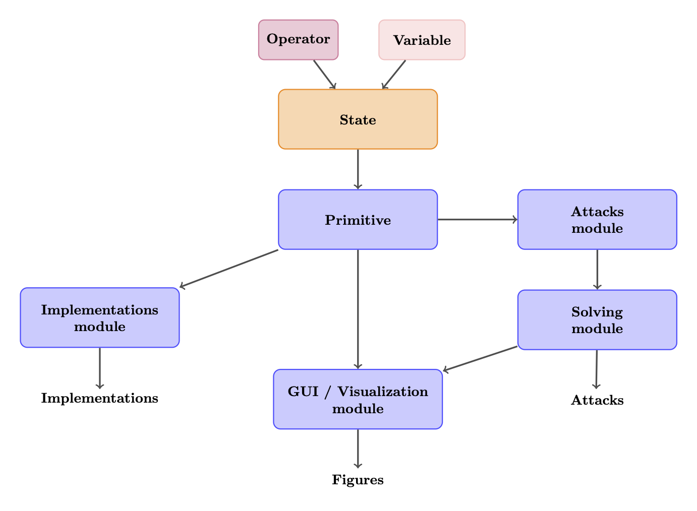

# OCP (Open Cryptanalysis Platform)

The OCP tool is composed of the following main modules:

- **OCP.py** is the main file of the OCP tool, with some utilization examples. Users can launch scripts to analyze cryptographic primitives. 

- **variables** contains the class that can be used to create variables for the modelling of a cryptographic primitive.

- **operators** contains the various operators that can be used to build the modelisation of a cryptographic primitive. Users can add new operators here if needed, or add new ways to model the operators. 
   
- **primitives** contains the modelisation of various cryptographic primitives (using variables and operators), including permutations and block ciphers. Many existing cryptographic primitives are already modeled. Users can add their own cryptographic primitives if not already present.

- **attacks** contains various pre-defined attack modules, including differential and linear attacks. Users can perform attacks on predefined primitives.

- **solving** contains automated solving techniques, including MILP, SAT, and CP solvers.

- **implementations** contains the automated implementation modules of the cryptographic primitives, including C, Python, and Verilog.
  
- **visualizations** contains the methods to display the cryptographic primitives, the distinguishers, and the attacks. 

- **tools** contains various specific tools used in OCP.

- **test** contains various test scripts for attacks and implementations.

The overall structure is illustrated in the diagram below:

  

⬇️ You can download OCP from the [OCP GitHub](https://open-cp.github.io/OCP/).    
📖 For detailed documentation, visit the [OCP Wiki](https://github.com/Open-CP/OCP/wiki).  

